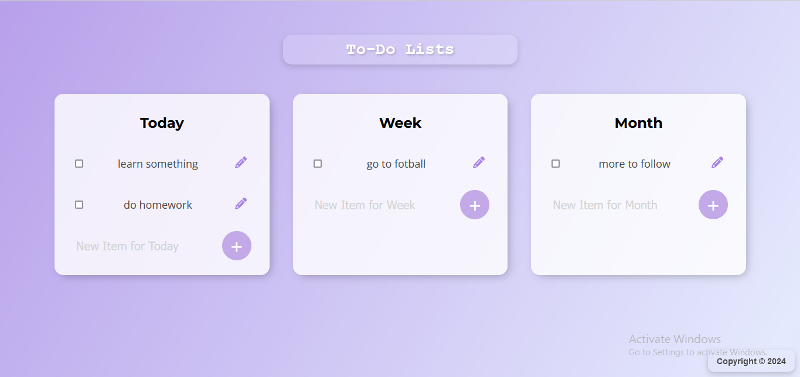

# To-Do List App

This is a simple and elegant To-Do List web application built using HTML, CSS, and EJS for templating. It allows you to manage your tasks efficiently across three categories: Today, Week, and Month.



## Features
- Create, update, and delete tasks in different categories.
- Responsive and modern design with a gradient background.
- Easy-to-use interface for managing daily, weekly, and monthly tasks.

## Technologies Used
- HTML, CSS for the frontend design.
- EJS for server-side templating.
- Express.js and PostgreSQL for the backend.

## Installation

1. Clone this repository:
   
   ```bash
   git clone https://github.com/your-user/repo-name.git
   
3. Navigate to the project directory:
   
   ```bash
   cd your-repo-name
   
4. Install the necessary dependencies:
   
   ```bash
   npm install
   
5. Set up your database:
   
- Make sure you have PostgreSQL installed and running.
- Open pgAdmin and connect to your PostgreSQL server.
- Right-click on Databases and select Create > Database....
- Name the database permalist and click Save.
- Open the queries.sql file, copy its contents, and paste it into a new query window in pgAdmin connected to the permalist database.
Execute the query to create the items table with the necessary columns (id, title, category).

5. Configure database connection:
   
- Open index.js and update the database configuration details (user, host, password) to match your PostgreSQL database settings.
   
6. Run the application:

   ```bash
   nodemon index.js

7. Open your browser and go to http://localhost:3000 to see the app in action.

## Usage

- Adding Tasks: Click on the "+" button to add a new task to any category.
- Editing Tasks: Use the pencil icon next to a task to edit it.
- Deleting Tasks: Click the checkbox to mark a task as done or remove it.
- Responsive Design: The app adjusts to different screen sizes, providing a consistent user experience on mobile and desktop.
